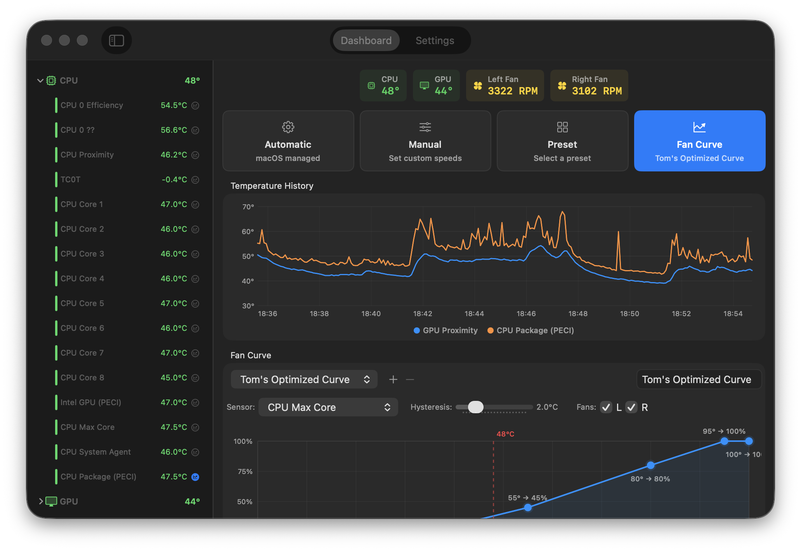
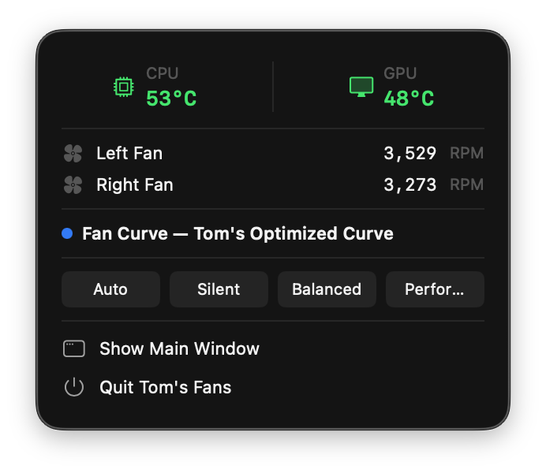

# Tom's Fans

**macOS fan monitoring & control for Apple Silicon and Intel Macs.**




## Features

- **Real-time temperature monitoring** — view CPU, GPU, and other sensor temperatures with live charts
- **4 control modes** — Auto (system default), Manual (fixed percentage), Curve (temperature-based), and Preset
- **Custom fan curves** — define temperature-to-speed curves with a visual editor
- **Presets** — save and quickly switch between fan configurations
- **Menu bar mode** — run as a compact menu bar app with quick controls
- **Notifications** — get alerts when temperatures exceed thresholds
- **Dashboard** — at-a-glance view of all fans and temperatures with gauges and graphs

Lightweight — ~1–2% CPU on a 2019 i9 MacBook Pro, ~60 MB memory.

## Requirements

- macOS 13.0+ (Ventura)
- Apple Silicon or Intel Mac

## Installation

### Download

Download the latest release from the [Releases](../../releases) page.

### Build from Source

1. Clone the repository:
   ```bash
   git clone https://github.com/thompstt/toms-fans.git
   cd toms-fans
   ```
2. Open `Tom's Fans.xcodeproj` in Xcode
3. Build and run (**Cmd+R**)
4. On first launch, the app will prompt to install the privileged helper for fan control

> **Note:** Writing fan speeds requires a privileged helper tool installed via SMJobBless. The app will guide you through installation.

## Usage

### Dashboard

The main window shows all detected fans with speed gauges, temperature sensors with live charts, and quick controls for each fan.

### Control Modes

| Mode | Description |
|------|-------------|
| **Auto** | System manages fan speed (default macOS behavior) |
| **Manual** | Set a fixed fan speed percentage |
| **Curve** | Fan speed follows a custom temperature-to-speed curve |
| **Preset** | Apply a saved configuration |

### Fan Curves

Open the curve editor to define control points mapping temperature ranges to fan speeds. The graph provides a visual preview of the response curve.

### Menu Bar Mode

Enable menu-bar-only mode in Settings to hide the dock icon and run entirely from the menu bar. The menu bar icon shows a quick summary and allows mode switching.

### Settings

Configure temperature units, notification thresholds, launch-at-login, menu bar behavior, and helper tool management.

## Architecture

```
Tom's Fans
├── App                    SwiftUI application (dashboard, settings, menu bar)
├── Helper                 Privileged helper tool (writes to SMC via XPC)
├── Shared/SMCKit          SMC read/write interface (IOKit)
└── Shared/XPCProtocol     XPC communication protocol
```

- **App** — SwiftUI frontend providing monitoring views, fan controls, and curve editing
- **Privileged Helper** — a launchd-managed helper installed via `SMJobBless` that performs SMC writes with elevated privileges
- **XPC** — secure inter-process communication between the app and the helper
- **SMCKit** — low-level System Management Controller access via IOKit for reading temperatures and fan data

Built entirely with Apple frameworks: SwiftUI, IOKit, ServiceManagement, UserNotifications, and Combine.

## Disclaimer

**Use at your own risk.** Overriding system fan controls can cause hardware to overheat. This software is provided as-is with no warranty. The authors are not responsible for any hardware damage resulting from improper fan configuration.

Always ensure adequate cooling. If temperatures rise beyond safe limits, the app will restore automatic fan control.

## License

This project is licensed under the [MIT License](LICENSE).
